# Documentation fonctionnelle : supervision, métriques, logs et réponse à incident

Infrastructure de supervision déployée sur un hyperviseur **Proxmox VE 9.2.18** : Zabbix, Prometheus, Grafana, Elastic Stack (Elasticsearch, Logstash, Kibana, Filebeat), capture réseau avec tshark et playbooks de réponse à incident.

## Sommaire

1. [Vue d'ensemble](#1-vue-densemble)
2. [Architecture](#2-architecture)
3. [Zabbix : supervision d'un hôte](#3-zabbix--supervision-dun-hôte)
4. [Prometheus : collecte de métriques](#4-prometheus--collecte-de-métriques)
5. [Grafana : visualisation](#5-grafana--visualisation)
6. [Zabbix : déclencheur et action d'alerte](#6-zabbix--déclencheur-et-action-dalerte)
7. [Elastic Stack : centralisation des logs](#7-elastic-stack--centralisation-des-logs)
8. [tshark : capture réseau](#8-tshark--capture-réseau)
9. [Kibana : analyse des logs](#9-kibana--analyse-des-logs)
10. [Playbooks de réponse à incident](#10-playbooks-de-réponse-à-incident)
11. [Récapitulatif des accès](#11-récapitulatif-des-accès)

---

## 1. Vue d'ensemble

### Objectif

Mettre en place une chaîne complète d'observabilité et de sécurité opérationnelle, couvrant quatre besoins :

| Besoin | Outil | Question à laquelle il répond |
|---|---|---|
| Supervision et alerting | Zabbix | Le système est-il disponible et dans les seuils ? |
| Métriques et tableaux de bord | Prometheus + Grafana | Comment évoluent les ressources dans le temps ? |
| Centralisation et analyse des logs | Filebeat + Logstash + Elasticsearch + Kibana | Pourquoi une panne ou une anomalie s'est-elle produite ? |
| Analyse réseau | tshark | Quel trafic circule sur l'interface ? |

Le dernier volet formalise deux playbooks de réponse à incident (modèle **Contenir → Éradiquer → Récupérer**).

### Périmètre

Tout est déployé sur des machines virtuelles Debian dans un réseau privé `192.168.30.0/24`. Aucun composant n'est exposé sur Internet dans ce document.

---

## 2. Architecture

| Machine (VM) | Adresse IP | Rôle | Ports utilisés |
|---|---|---|---|
| Zabbix | `192.168.30.100` | Serveur Zabbix, interface web, agents, Filebeat | 80 (web), 10050 (agent), 10051 (serveur) |
| Grafana | `192.168.30.101` | Visualisation | 3000 |
| ELK | `192.168.30.104` | Elasticsearch, Logstash, Kibana | 9200, 5044, 5601 |
| Prometheus | `192.168.30.106` | Collecte de métriques, node_exporter, tshark | 9090, 9100 |

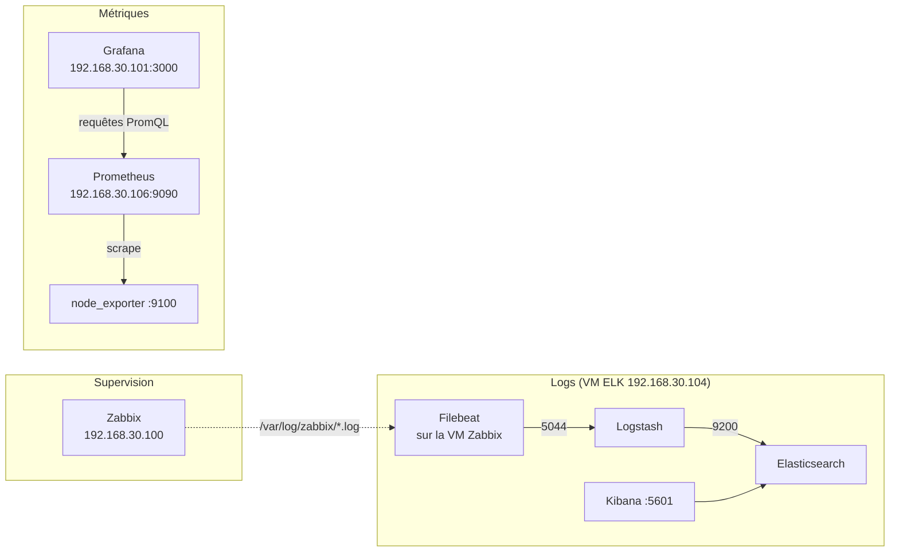
```mermaid
flowchart LR
    subgraph SUP["Supervision"]
        Z["Zabbix<br/>192.168.30.100"]
    end
    subgraph MET["Métriques"]
        P["Prometheus<br/>192.168.30.106:9090"] -->|scrape| NE["node_exporter :9100"]
        G["Grafana<br/>192.168.30.101:3000"] -->|requêtes PromQL| P
    end
    subgraph LOG["Logs (VM ELK 192.168.30.104)"]
        FB["Filebeat<br/>sur la VM Zabbix"] -->|5044| LS["Logstash"]
        LS -->|9200| ES["Elasticsearch"]
        K["Kibana :5601"] --> ES
    end
    Z -. "/var/log/zabbix/*.log" .-> FB
```

Deux modèles de collecte coexistent :

- **Zabbix** : un serveur et des agents (l'agent remonte les données au serveur).
- **Prometheus** : modèle *pull*, c'est Prometheus qui interroge (« scrape ») ses cibles.

---

## 3. Zabbix : supervision d'un hôte

### 3.1 Objectif

Superviser un hôte nommé `VM_Entreprise` avec le modèle standard *Linux by Zabbix agent* et vérifier la remontée automatique des éléments et des graphiques.

### 3.2 Déploiement du serveur

Le serveur Zabbix est installé sur une VM Proxmox (VM 107, nommée `zabbix`). Son adresse IP est `192.168.30.100`.

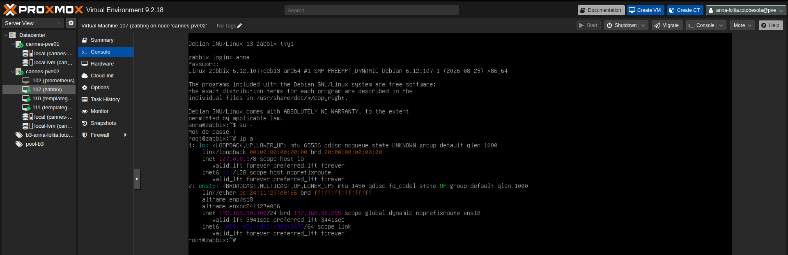
*Fig. 1 : Console Proxmox de la VM Zabbix (adresse `192.168.30.100`).*

Après installation de Zabbix et de ses agents, l'assistant web (`/zabbix/setup.php`) demande de configurer la connexion à la base de données :

| Paramètre | Valeur |
|---|---|
| Type de base de données | MySQL |
| Hôte | `localhost` |
| Port | `0` (utiliser le port par défaut) |
| Nom de la base | `zabbix` |
| Utilisateur | `zabbix` |
| Stockage des identifiants | Texte brut |

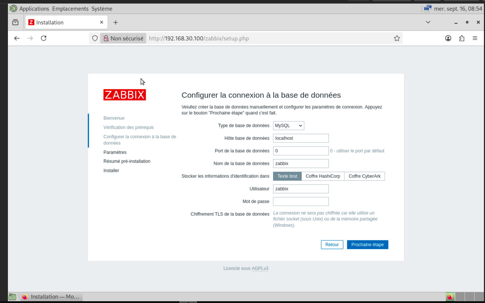
*Fig. 2 : Assistant d'installation web, configuration de la base de données.*

### 3.3 Première connexion

L'accès se fait avec les identifiants par défaut de la documentation officielle (`Admin` / `zabbix`, à modifier en production). Le tableau de bord « Global view » s'affiche.

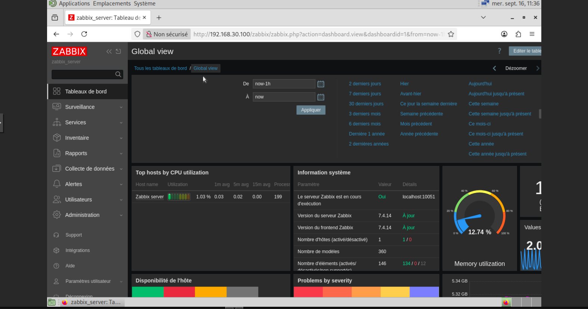
*Fig. 3 : Tableau de bord Global view.*

La page « Information système » indique notamment la version 7.4.14 du serveur et du frontend.

### 3.4 Création de l'hôte

Chemin : **Menu > Collecte de données > Hôtes > Créer un hôte**.

| Champ | Valeur |
|---|---|
| Nom de l'hôte | `VM_Entreprise` |
| Modèle | *Linux by Zabbix agent* |
| Groupe d'hôtes | `Linux servers` |
| Interface | Type Agent, IP `127.0.0.1`, port `10050` |
| Surveillé par | Serveur |
| Activé | Oui |

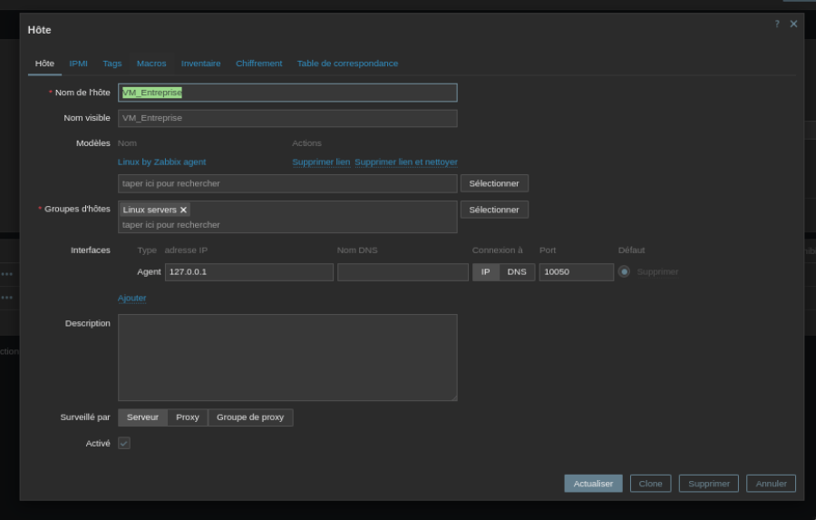
*Fig. 4 : Formulaire de création de l'hôte `VM_Entreprise`.*

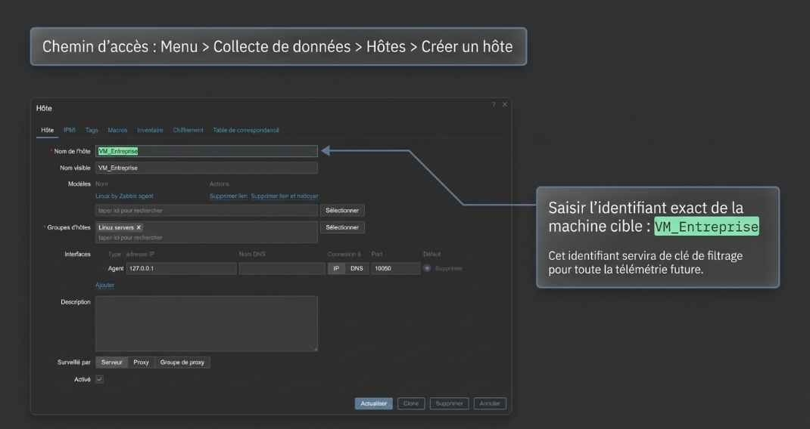
*Fig. 5 : Chemin d'accès et saisie du nom exact de l'hôte.*

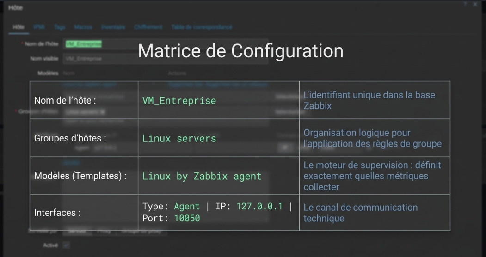
*Fig. 6 : Matrice de configuration de l'hôte.*

### 3.5 Vérification des éléments et des graphiques

**Éléments** : Menu > Collecte de données > Éléments, filtre `Hôtes = VM_Entreprise`. Le modèle instancie automatiquement **68 éléments** (CPU, mémoire, réseau, OS, systèmes de fichiers) sans configuration manuelle supplémentaire.

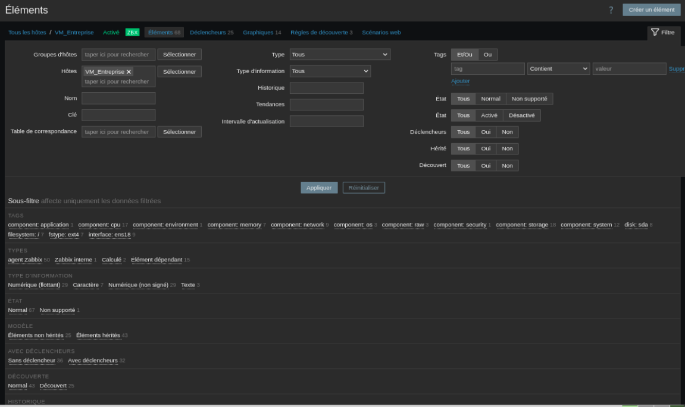
*Fig. 7 : Éléments collectés pour `VM_Entreprise`.*

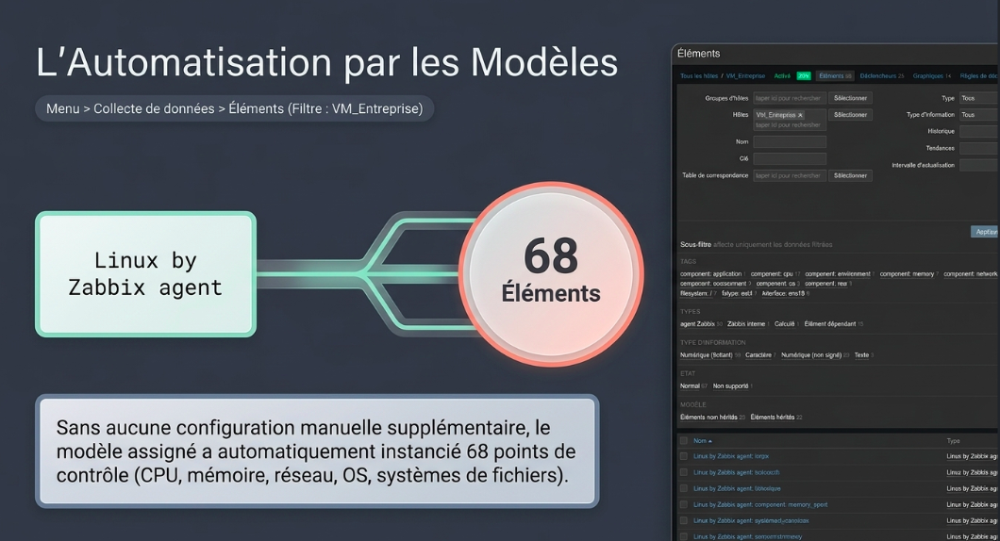
*Fig. 8 : Automatisation par les modèles : 68 éléments.*

**Graphiques** : **14 graphiques** sont générés, dont :

- CPU usage et System load ;
- Memory utilization ;
- Network traffic (interface `ens18`) ;
- Disk utilization et queue.

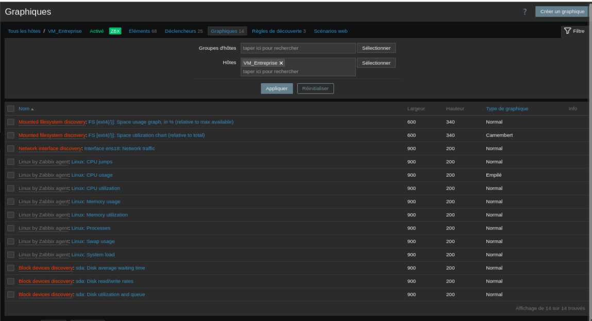
*Fig. 9 : Graphiques générés pour `VM_Entreprise`.*

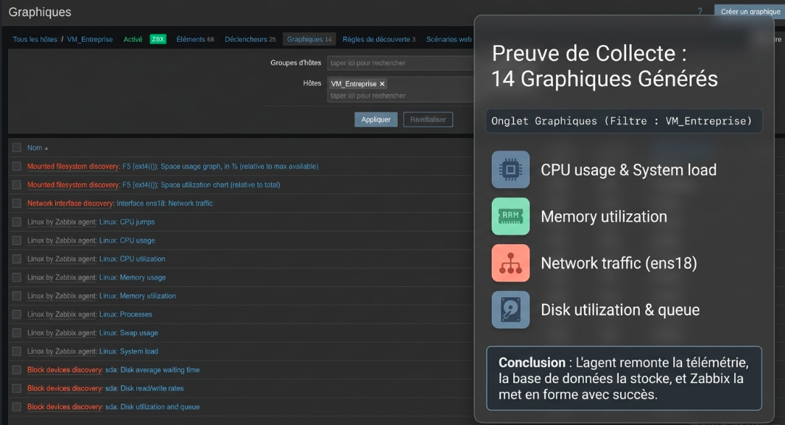
*Fig. 10 : Preuve de collecte : 14 graphiques.*

### 3.6 Synthèse visuelle

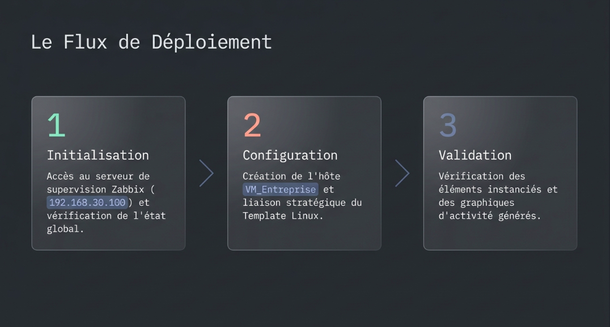
*Fig. 11 : Flux de déploiement (initialisation, configuration, validation).*

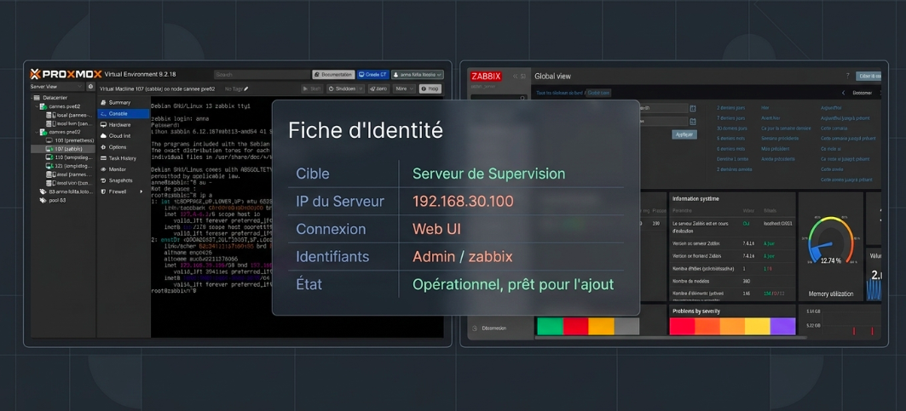
*Fig. 12 : Fiche d'identité du serveur de supervision.*

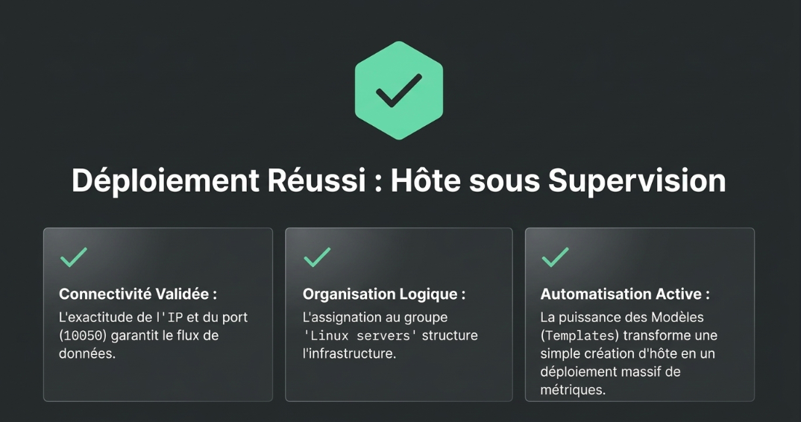
*Fig. 13 : Déploiement réussi.*

### 3.7 Critères de validation

- [x] L'interface web répond sur `http://192.168.30.100/zabbix`
- [x] L'hôte `VM_Entreprise` est créé avec le modèle Linux
- [x] 68 éléments et 14 graphiques sont présents

---

## 4. Prometheus : collecte de métriques

### 4.1 Objectif

Installer Prometheus sur une VM dédiée et lui faire collecter ses propres métriques ainsi que celles du système via `node_exporter`.

### 4.2 Préparation de la VM

VM créée avec l'ISO **Debian 12.3.0**, configurée **sans interface graphique**. Adresse IP relevée avec `ip a` : `192.168.30.106/24` (interface `ens18`).

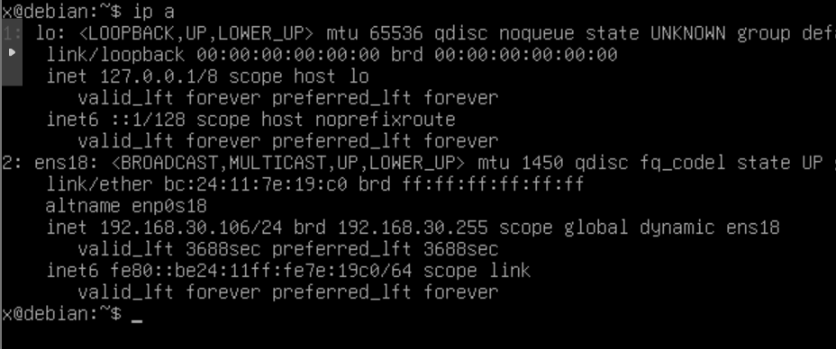
*Fig. 14 : Adresse IP de la VM Prometheus.*

### 4.3 Installation

Prometheus est installé depuis les paquets Debian (paquet `prometheus` 2.42.0+ds-5+deb12u1). Le paramétrage installe également les minuteurs de `prometheus-node-exporter`.

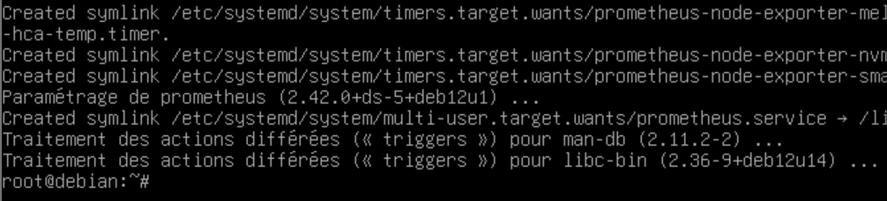
*Fig. 15 : Installation de Prometheus.*

### 4.4 Vérification du service

```bash
systemctl status prometheus
curl http://localhost:9090
```

Le service est `enabled` et `active (running)`. Le `curl` renvoie une redirection vers `/classic/graph`, ce qui confirme que l'interface répond.

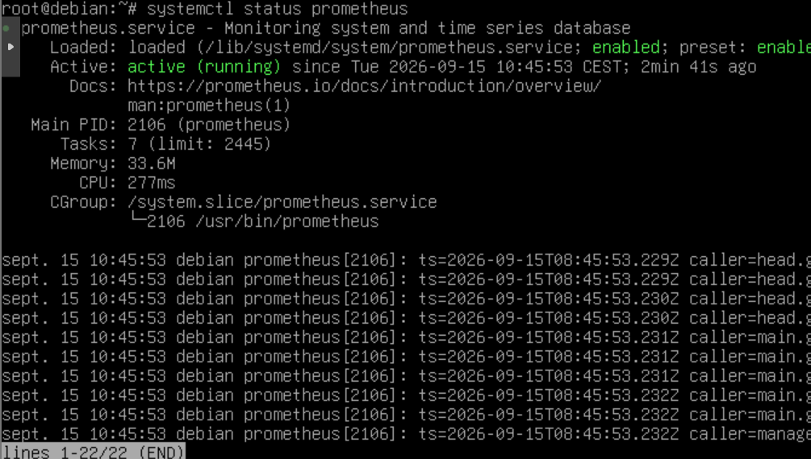
*Fig. 16 : `systemctl status prometheus`.*

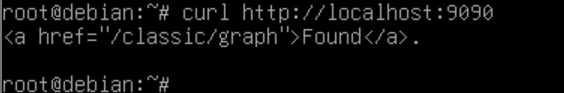
*Fig. 17 : `curl http://localhost:9090`.*

### 4.5 Configuration des jobs de scrape

Dans `prometheus.yml`, section `scrape_configs` :

```yaml
scrape_configs:
  - job_name: 'prometheus'
    static_configs:
      - targets: ['localhost:9090']

  - job_name: node
    static_configs:
      - targets: ['localhost:9100']
```

| Job | Cible | Contenu |
|---|---|---|
| `prometheus` | `localhost:9090` | Métriques de Prometheus lui-même |
| `node` | `localhost:9100` | Métriques système exposées par `node_exporter` |

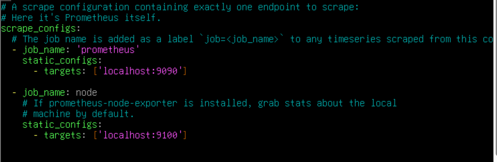
*Fig. 18 : Configuration des jobs de scrape.*

Après sauvegarde, redémarrage du service :

```bash
systemctl restart prometheus
systemctl status prometheus
```

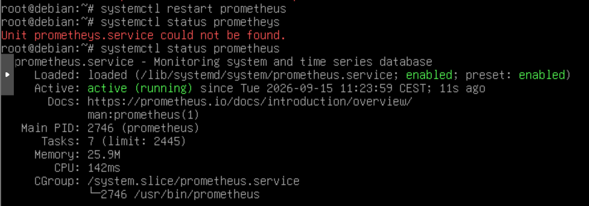
*Fig. 19 : Redémarrage de Prometheus.*

### 4.6 Vérification des cibles

```bash
curl http://localhost:9090/api/v1/targets
```

Les deux cibles actives remontent `"health":"up"` : `node` sur `localhost:9100` et `prometheus` sur `localhost:9090`.

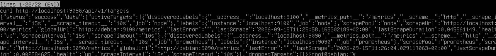
*Fig. 20 : API `/api/v1/targets`, les deux cibles sont `up`.*

---

## 5. Grafana : visualisation

### 5.1 Objectif

Installer Grafana, le relier à Prometheus comme source de données et créer un tableau de bord de suivi de la mémoire disponible.

### 5.2 Installation et accès

`grafana-server` est installé sur une VM Proxmox dédiée (IP `192.168.30.101`). Le service est démarré (`systemctl restart grafana-server`) puis vérifié avec `systemctl status grafana-server` (état `active (running)`).

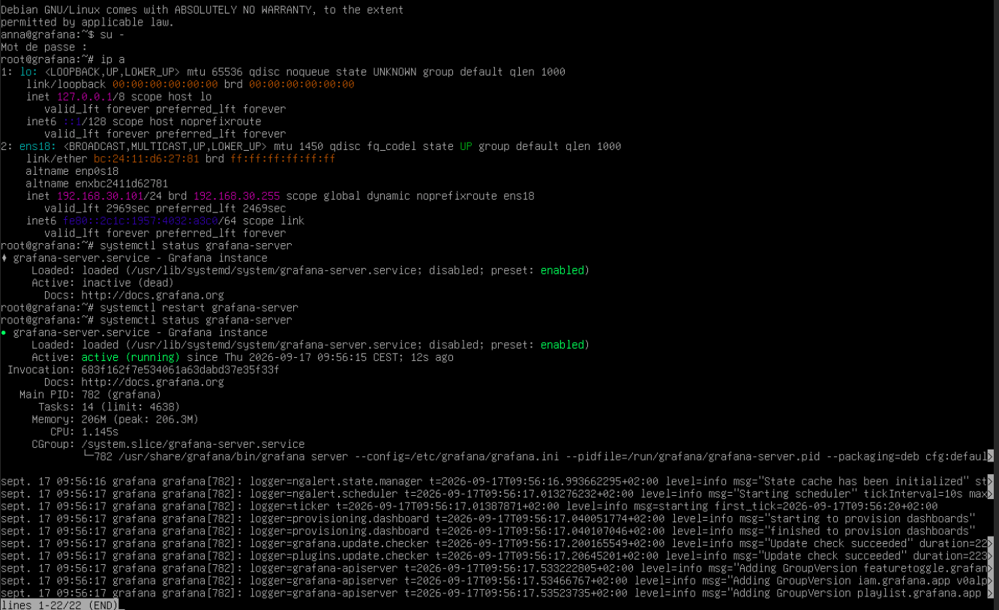
*Fig. 21 : VM Grafana, adresse IP et service en cours d'exécution.*

Accès depuis une VM avec interface graphique : `http://192.168.30.101:3000`. À la première connexion, Grafana impose de **changer le mot de passe par défaut**.

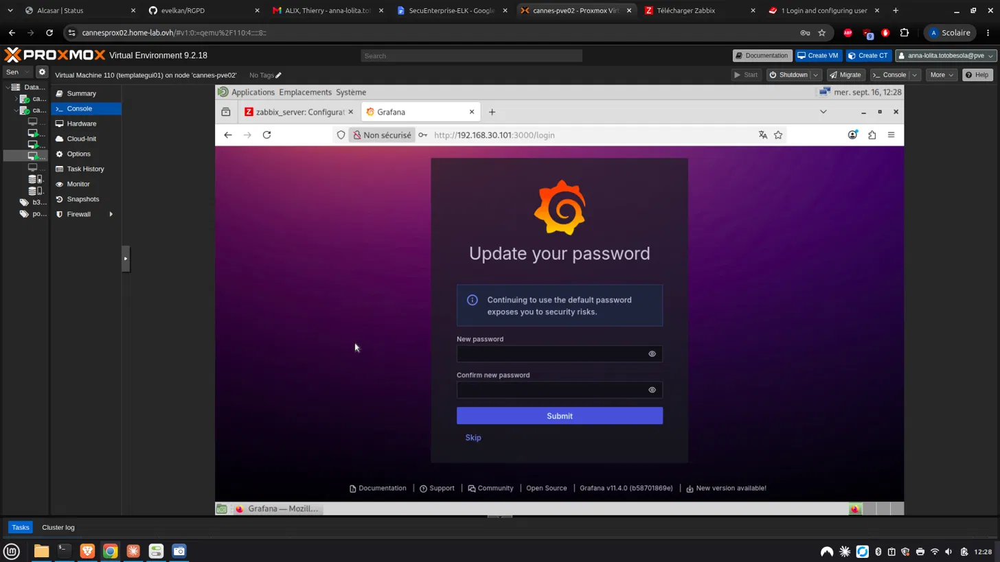
*Fig. 22 : Changement du mot de passe à la première connexion.*

### 5.3 Ajout de Prometheus comme source de données

Chemin : **Menu > Connections > Data sources > + Add data source > Prometheus**.

| Paramètre | Valeur |
|---|---|
| Prometheus server URL | `http://<IP de la VM Prometheus>:9090` |
| Authentication methods | No Authentication |
| Action | Save & Test |

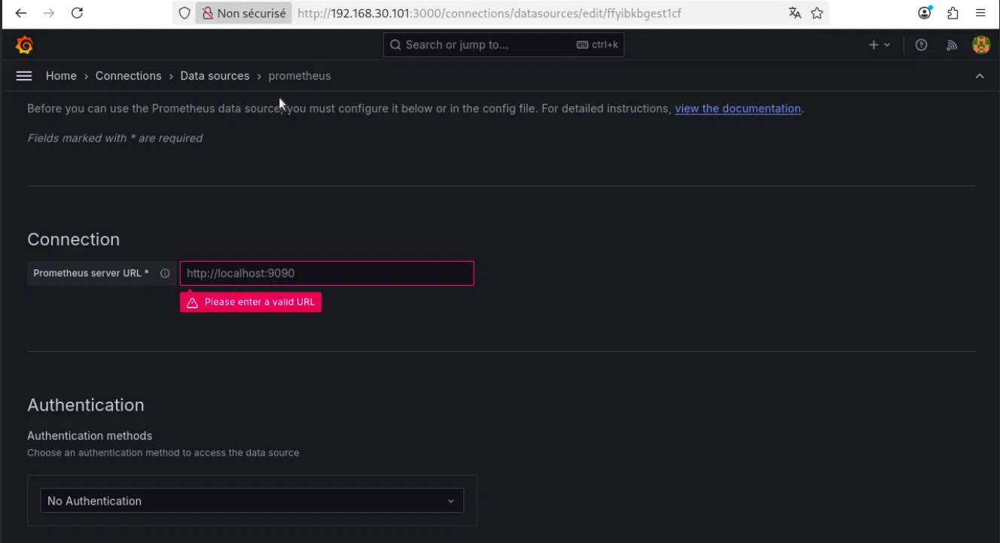
*Fig. 23 : Formulaire de la source de données (URL non encore saisie).*

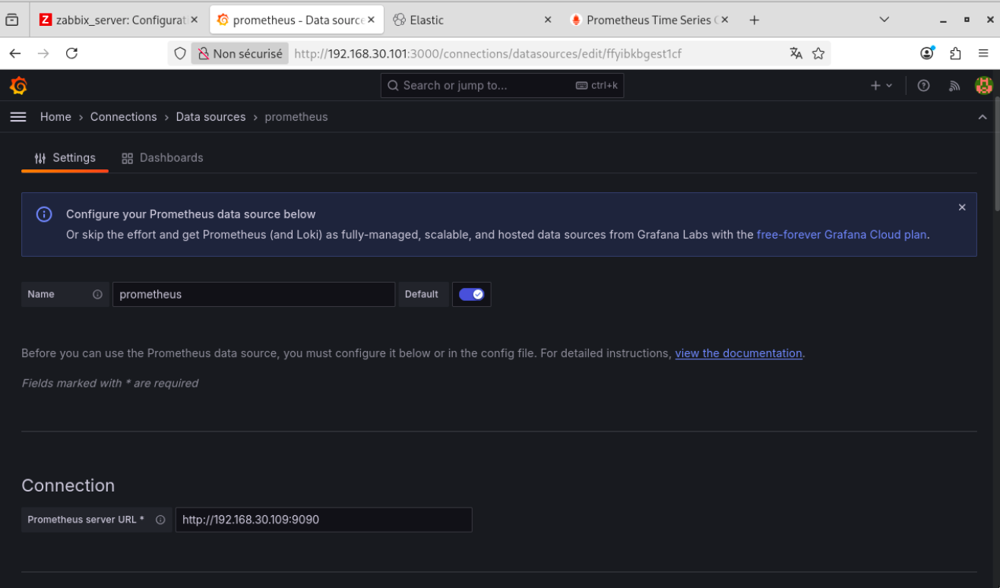
*Fig. 24 : Source de données Prometheus configurée.*

> **Note :** l'adresse relevée sur la VM Prometheus est `192.168.30.106` (section 4.2), alors que la capture ci-dessus affiche `192.168.30.109`. Il faut utiliser l'adresse réelle de la VM Prometheus.

### 5.4 Tableau de bord « Mémoire disponible »

Chemin : **Menu > Dashboards > + Create > Add visualization**.

| Paramètre | Valeur |
|---|---|
| Source de données | `prometheus` |
| Type de visualisation | Time series |
| Métrique / requête PromQL | `node_memory_MemAvailable_bytes` |
| Titre du panneau | Mémoire disponible |
| Période | Last 6 hours |

Le graphique affiche l'évolution de la mémoire disponible (en octets) de l'instance `localhost:9100`, job `node`.

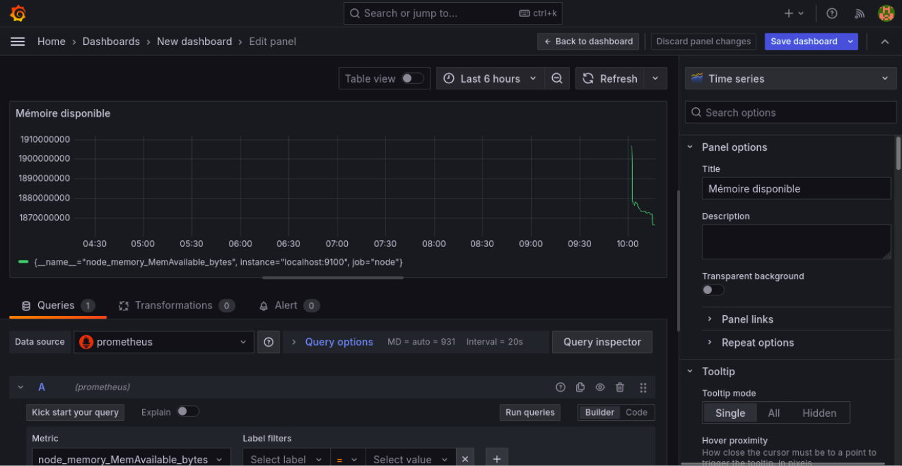
*Fig. 25 : Panneau « Mémoire disponible ».*

### 5.5 Principe de fonctionnement (modèle pull)

1. `node_exporter` expose les métriques système sur le port 9100.
2. Prometheus les collecte périodiquement (scrape).
3. Grafana interroge l'API de Prometheus (source de données).
4. Grafana exécute des requêtes PromQL pour dessiner les graphiques.

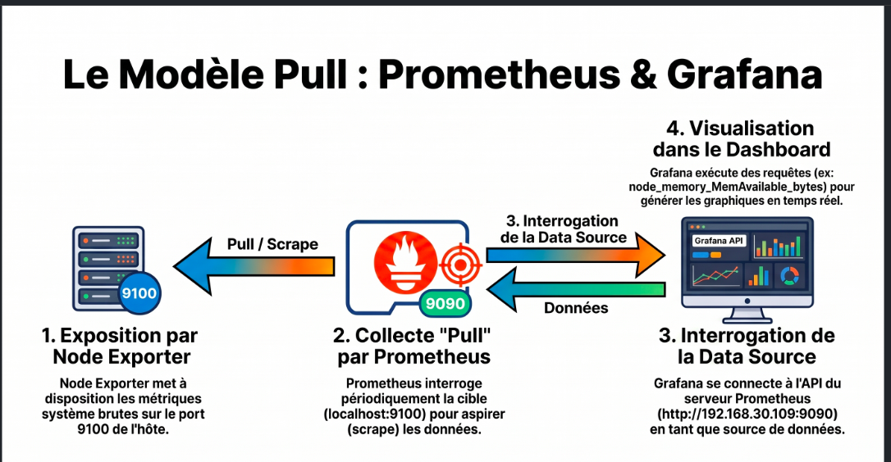
*Fig. 26 : Le modèle pull : Prometheus et Grafana.*

---

## 6. Zabbix : déclencheur et action d'alerte

### 6.1 Objectif

Créer un déclencheur sur l'utilisation CPU, puis une action qui envoie un message à l'administrateur lorsque ce déclencheur passe en alerte.

### 6.2 Point de départ

Depuis l'interface web Zabbix, la liste des hôtes montre l'hôte `Zabbix server` avec 146 éléments, 78 déclencheurs, 14 graphiques et 6 règles de découverte (interface `127.0.0.1:10050`, modèles *Linux by Zabbix agent* et *Zabbix server health*).

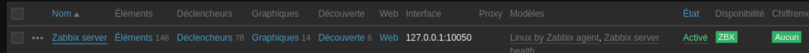
*Fig. 27 : Hôte `Zabbix server` (146 éléments, 78 déclencheurs).*

### 6.3 Création du déclencheur

Condition de l'expression :

| Champ | Valeur |
|---|---|
| Élément | `Zabbix server: CPU utilization` |
| Fonction | `last()` : dernière valeur la plus récente |
| Dernier (T) | le plus récent |
| Résultat | `> 80` |

Sévérité du déclencheur : **Haut**.

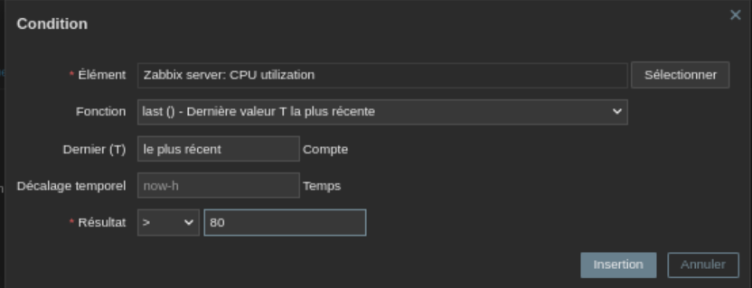
*Fig. 28 : Condition du déclencheur (CPU utilization supérieur à 80).*

### 6.4 Création de l'action

Chemin : **Alertes > Actions > Actions de déclencheur > Créer une action**. Nom : `Alerte CPU Par email`.

**Condition de l'action** : le type de condition est changé de « Nom de l'événement » vers « Sévérité du déclencheur », avec l'opérateur « est supérieur ou égal à » et la sévérité **Haut**.

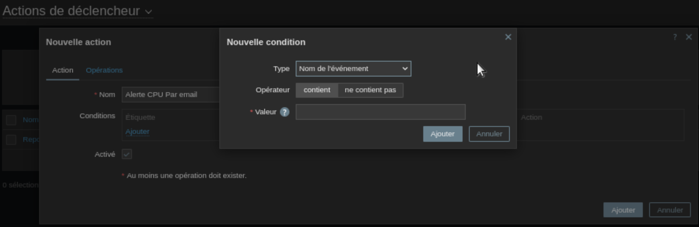
*Fig. 29 : Nouvelle action, choix du type de condition.*

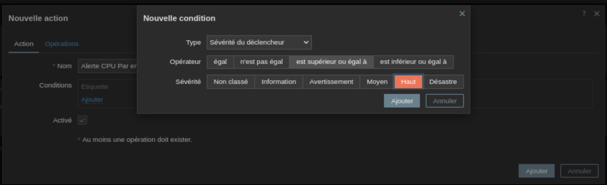
*Fig. 30 : Condition « sévérité supérieure ou égale à Haut ».*

**Opération** (onglet Opérations) :

| Paramètre | Valeur |
|---|---|
| Opération | Envoi message |
| Étapes | 1 à 1 |
| Envoyer aux utilisateurs | `Admin (Zabbix Administrator)` |
| Type de média | Tous disponibles |

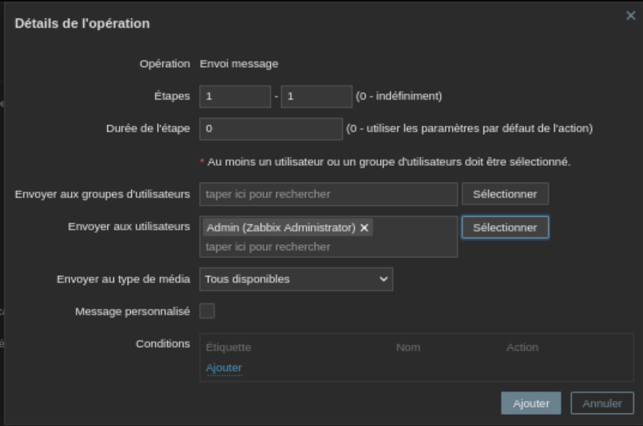
*Fig. 31 : Détails de l'opération.*

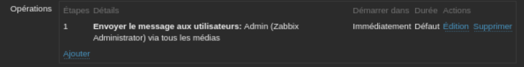
*Fig. 32 : Opération enregistrée (envoi immédiat à Admin).*

### 6.5 Résultat

L'action `Alerte CPU Par email` apparaît avec l'état **Activé** (en vert). L'action par défaut `Report problems to Zabbix administrators` est **désactivée**.

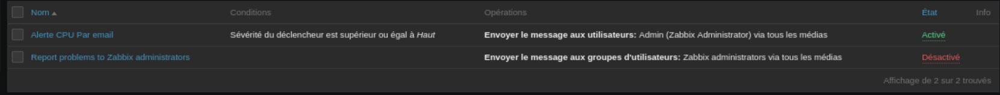
*Fig. 33 : Liste des actions.*

---

## 7. Elastic Stack : centralisation des logs

### 7.1 Objectif

Collecter les journaux de Zabbix, les transporter jusqu'à Elasticsearch et les rendre exploitables dans Kibana.

### 7.2 Architecture des logs

| Étape | Composant | Machine | Rôle |
|---|---|---|---|
| 1. Collecte | Filebeat | VM Zabbix `192.168.30.100` | Lit `/var/log/zabbix/*.log` et envoie vers Logstash (port 5044) |
| 2. Traitement | Logstash | VM ELK `192.168.30.104` | Reçoit sur 5044, envoie vers Elasticsearch, index quotidien `zabbix-YYYY.MM.dd` |
| 3. Stockage | Elasticsearch | VM ELK | Écoute sur `localhost:9200` |
| 4. Exploration | Kibana | VM ELK | Interface sur le port 5601 |

### 7.3 Logs Zabbix à collecter

```bash
ls -la /var/log/zabbix/
```

Fichiers présents : `zabbix_agent2.log`, `zabbix_agentd.log`, `zabbix_java_gateway.log`, `zabbix_server.log`, `zabbix_web_service.log`.

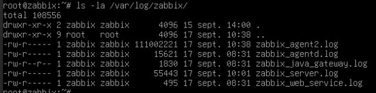
*Fig. 34 : Journaux Zabbix disponibles.*

### 7.4 Vérification d'Elasticsearch

```bash
curl -X GET "http://localhost:9200/"
```

La réponse indique un nœud `elk`, cluster `elasticsearch`, version **8.19.21**.

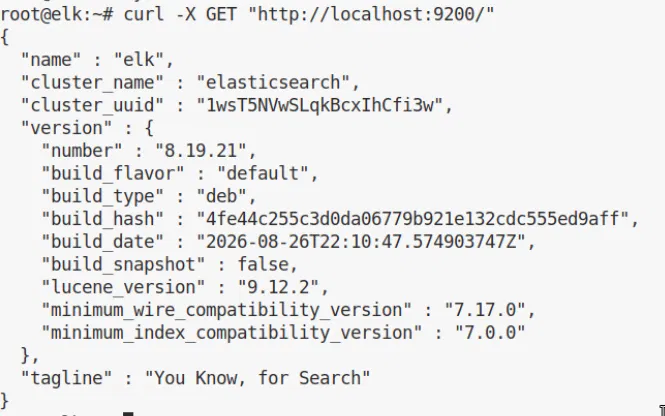
*Fig. 35 : Elasticsearch opérationnel.*

### 7.5 Installation de Filebeat (VM Zabbix)

Filebeat **8.11.0** est installé à partir du paquet `.deb` :

```bash
cd /tmp
curl -L -O https://artifacts.elastic.co/downloads/beats/filebeat/filebeat-8.11.0-amd64.deb
dpkg -i filebeat-8.11.0-amd64.deb
```

Alternative documentée : via le dépôt APT Elastic 8.x.

```bash
curl -fsSL https://artifacts.elastic.co/GPG-KEY-elastic | sudo gpg --dearmor -o /usr/share/keyrings/elastic-archive-keyring.gpg
echo "deb [signed-by=/usr/share/keyrings/elastic-archive-keyring.gpg] https://artifacts.elastic.co/packages/8.x/apt stable main" | sudo tee /etc/apt/sources.list.d/elastic-8.x.list
sudo apt-get update
sudo apt-get install filebeat -y
```

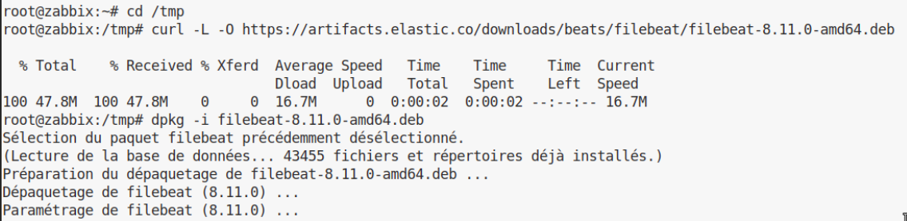
*Fig. 36 : Installation de Filebeat.*

### 7.6 Configuration de Filebeat

Fichier `/etc/filebeat/filebeat.yml` :

```yaml
filebeat.inputs:
  - type: log
    enabled: true
    paths:
      - /var/log/zabbix/*.log

output.logstash:
  hosts: ["192.168.30.104:5044"]
```

Démarrage et contrôle :

```bash
sudo systemctl start filebeat
sudo systemctl status filebeat
```

### 7.7 Configuration de Logstash (VM ELK)

Fichier `/etc/logstash/conf.d/zabbix.conf` :

```
input {
  beats {
    port => 5044
  }
}

output {
  elasticsearch {
    hosts => ["localhost:9200"]
    index => "zabbix-%{+YYYY.MM.dd}"
  }
}
```

```bash
sudo systemctl restart logstash
sudo systemctl status logstash
```

### 7.8 Vérification de l'arrivée des logs

```bash
curl -X GET "http://localhost:9200/_cat/indices"
```

L'index `zabbix-2026.09.17` est créé et reçoit les logs : **706 917 documents, 195,4 Mo**. Son état `yellow` correspond au cas usuel d'un cluster à un seul nœud (les répliques ne peuvent pas être allouées).

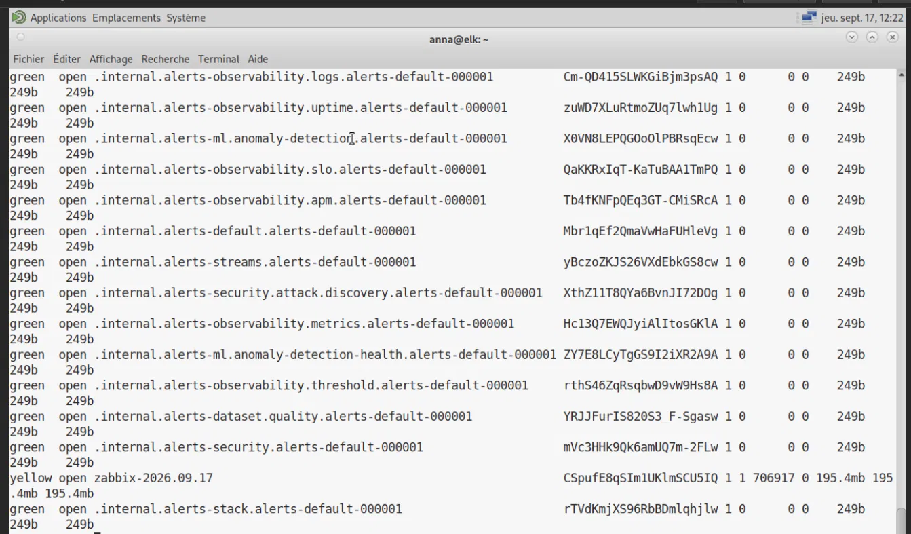
*Fig. 37 : Index `zabbix-2026.09.17`.*

### 7.9 Accès à Kibana et création de la Data View

Kibana : `http://192.168.30.104:5601`.

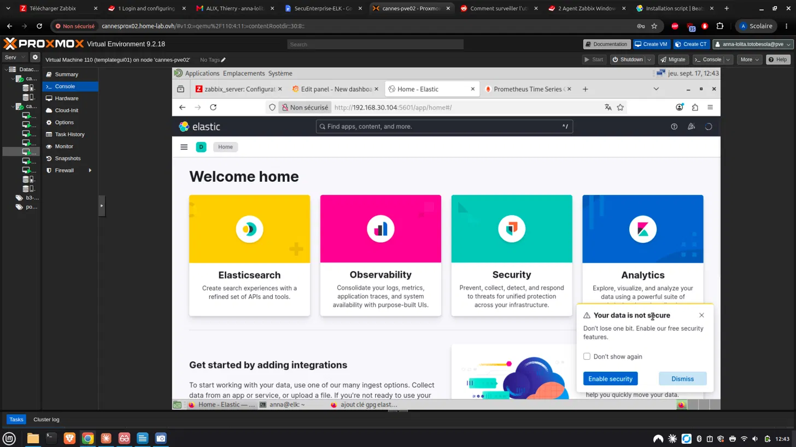
*Fig. 38 : Page d'accueil de Kibana.*

Chemin : **Stack Management > Kibana > Data Views > Create data view**.

| Paramètre | Valeur |
|---|---|
| Nom | `Zabbix Logs` |
| Index pattern | `zabbix-*` |
| Champ d'horodatage | `@timestamp` |

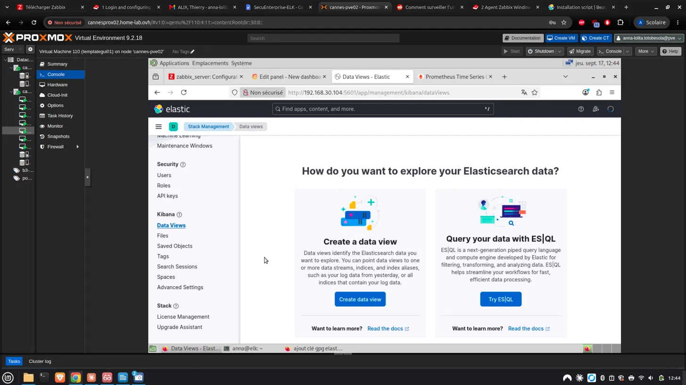
*Fig. 39 : Création d'une Data View, écran de départ.*

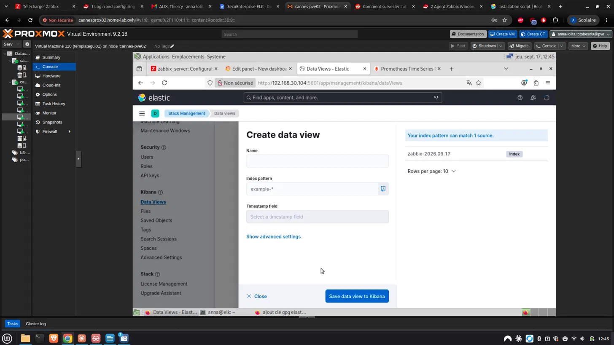
*Fig. 40 : Le motif d'index correspond à `zabbix-2026.09.17`.*

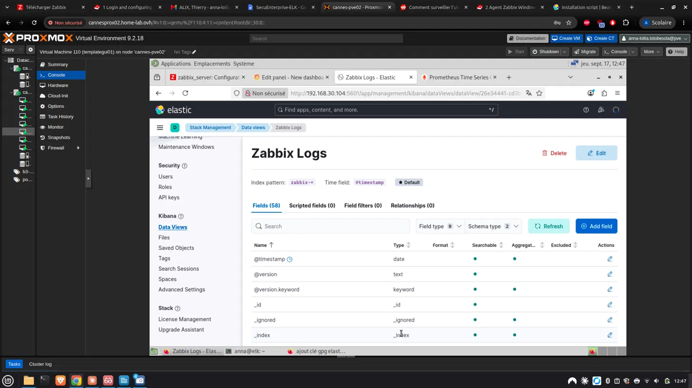
*Fig. 41 : Data View `Zabbix Logs` et ses champs.*

---

## 8. tshark : capture réseau

### 8.1 Objectif

Installer un outil d'analyse réseau et réaliser une capture de trafic. Aucune interface graphique n'étant disponible sur la VM Prometheus (réutilisée pour cette étape), l'outil en ligne de commande **tshark** est utilisé à la place de Wireshark.

### 8.2 Vérification des interfaces

```bash
tshark -D
```

15 interfaces sont listées, dont `ens18` (interface réseau principale), `any` et `lo` (loopback).

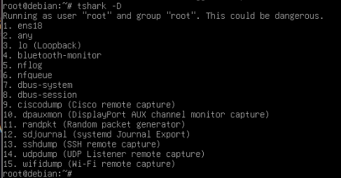
*Fig. 42 : Interfaces de capture disponibles.*

### 8.3 Capture de 30 secondes

```bash
tshark -i ens18 -a duration:30 -w /root/capture.pcap
```

La capture démarre et s'arrête correctement ; le fichier `/root/capture.pcap` est créé.

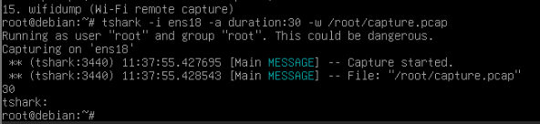
*Fig. 43 : Capture de 30 secondes.*

### 8.4 Lecture de la capture

```bash
tshark -r /root/capture.pcap | head -30
```

Le trafic observé est du trafic d'infrastructure : annonces **VRRP (v2)** émises par `192.168.30.1` vers `224.0.0.18` (environ une par seconde) et une sollicitation de routeur ICMPv6 (*Router Solicitation*).

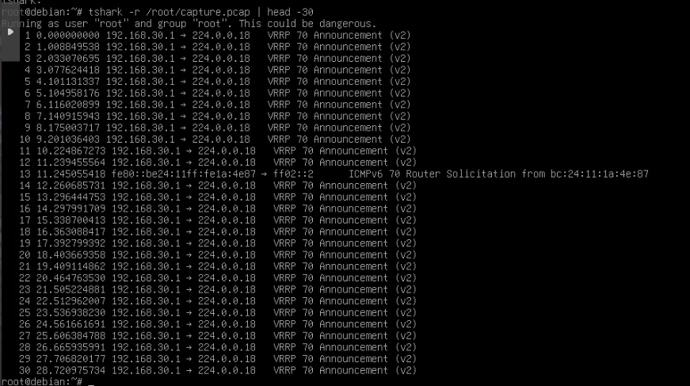
*Fig. 44 : Contenu de la capture (annonces VRRP).*

### 8.5 Statistiques de conversations

```bash
tshark -r /root/capture.pcap -q -z conv,tcp
```

Le tableau est vide : aucune conversation TCP n'a été générée pendant la capture, ce qui est cohérent avec l'absence de trafic envoyé par la VM.

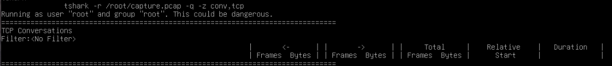
*Fig. 45 : Statistiques de conversations TCP.*

---

## 9. Kibana : analyse des logs

### 9.1 Objectif et flux d'analyse

```
Elasticsearch > Kibana Discover > Visualisations > Dashboard
```

### 9.2 Exploration dans Discover

Kibana propose plusieurs entrées dans le menu **Observability** (Overview, Alerts, SLOs, Cases, Logs, Infrastructure, Applications, Synthetics, User Experience). L'exploration des logs se fait dans **Discover**, avec la Data View `Zabbix Logs`.

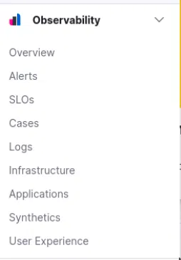
*Fig. 46 : Menu Observability.*

Sur la période de 15 minutes affichée, Discover liste 3 772 documents avec l'histogramme de volume, les champs disponibles (`agent.name`, `agent.type`, `host.hostname`, etc.) et le détail de chaque événement.

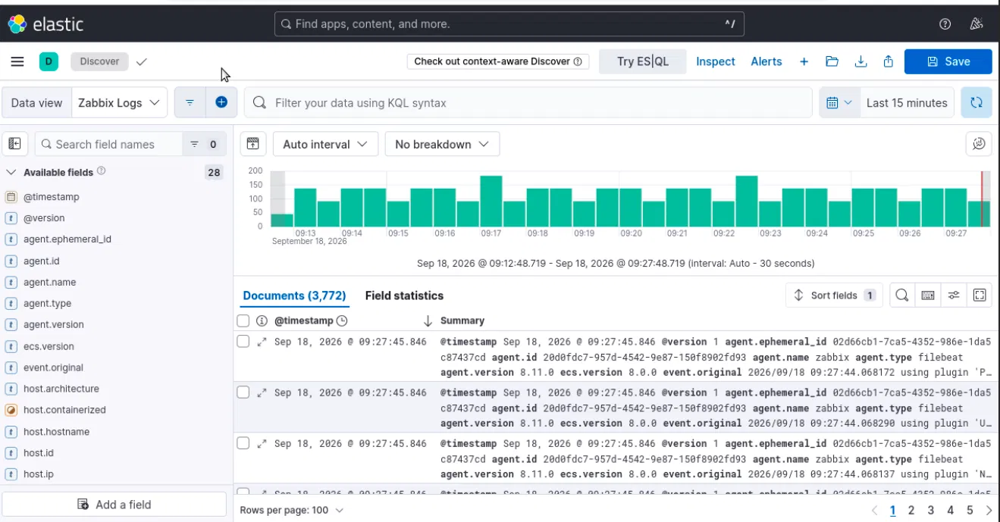
*Fig. 47 : Discover sur `Zabbix Logs`.*

### 9.3 Création d'une visualisation

Depuis un champ dans Discover, le bouton **Visualize** ouvre l'éditeur Lens. Exemple avec `agent.type` : 100 % des enregistrements viennent de `filebeat`.

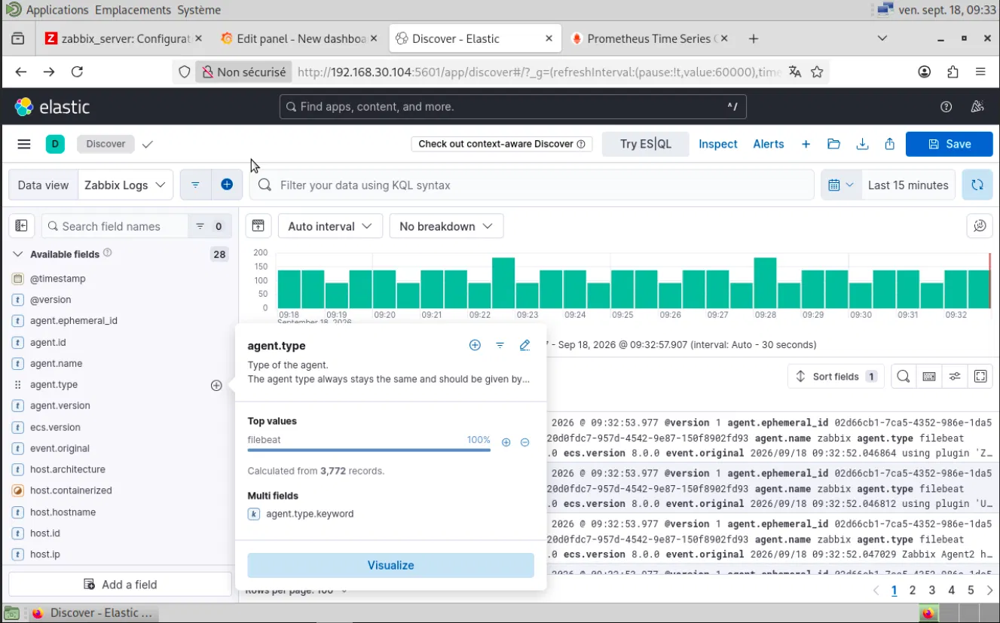
*Fig. 48 : Champ `agent.type` et bouton Visualize.*

Visualisation créée :

| Paramètre | Valeur |
|---|---|
| Type | Barres empilées |
| Axe horizontal | Top 5 des valeurs de `host.hostname.keyword` |
| Axe vertical | Count of records |
| Résultat | Un seul hôte (`zabbix`) concentre les enregistrements |

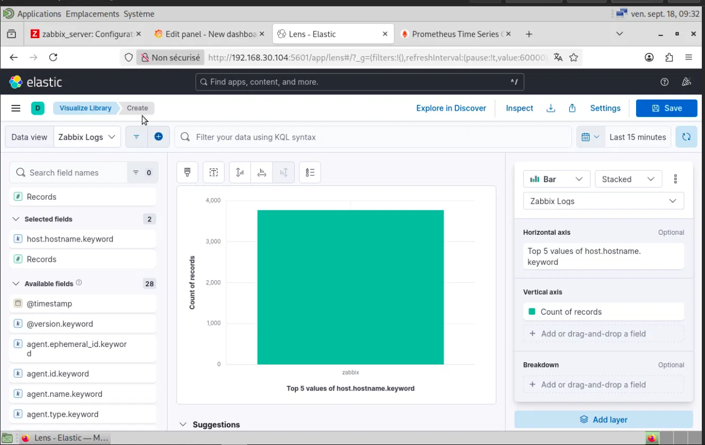
*Fig. 49 : Visualisation Lens.*

### 9.4 Sauvegarde et ajout à un dashboard

La visualisation est enregistrée sous le titre `Zabbix log hostname`, avec la possibilité de l'ajouter à un dashboard existant ou nouveau. On peut ajouter autant de graphiques que nécessaire.

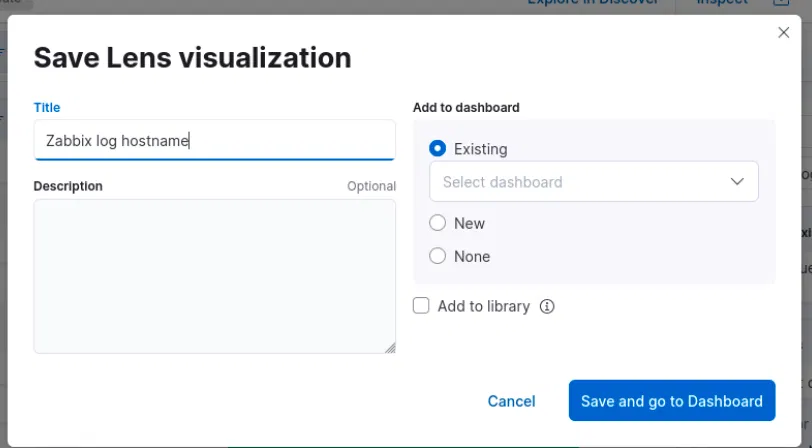
*Fig. 50 : Enregistrement de la visualisation.*

---

## 10. Playbooks de réponse à incident

Deux scénarios, structurés selon le modèle **Contenir → Éradiquer → Récupérer**. Les noms de scénarios s'inspirent de l'univers Star Trek (« Enterprise-D »).

### Scénario 1 : Intrusion des Borgs

**Contexte.** Une entité non identifiée « assimile » progressivement les systèmes : processus étrangers sur plusieurs machines, charge CPU anormale, nouvelles connexions sortantes non autorisées.
**Équivalent réel :** propagation d'un malware ou d'un ver sur le réseau interne, avec exfiltration de données ou prise de contrôle progressive (mouvement latéral).

**Détection**

- Alertes Zabbix : pics anormaux CPU/RAM sur plusieurs hôtes simultanément.
- Prometheus/Grafana : hausse progressive et synchronisée sur plusieurs systèmes.
- Wireshark/tshark : connexions vers des IP inconnues, volumes sortants anormaux.

**Procédure**

| Phase | Actions |
|---|---|
| **1. Contenir** | Isoler les systèmes touchés (déconnexion réseau ou VLAN de quarantaine) ; couper les connexions suspectes identifiées avec Wireshark ; **ne pas éteindre les machines** (préserver la mémoire vive pour l'analyse forensique) |
| **2. Éradiquer** | Identifier le point d'entrée initial (logs Kibana/ELK) ; supprimer les processus et fichiers malveillants ; changer tous les identifiants potentiellement compromis ; corriger la vulnérabilité exploitée |
| **3. Récupérer** | Restaurer depuis une sauvegarde saine antérieure à l'intrusion ; remettre les systèmes en ligne un par un avec surveillance renforcée ; documenter dans TheHive et partager les IoC via MISP |

### Scénario 2 : Sabotage des Klingons

**Contexte.** Accès sur un système critique en dehors des horaires normaux, modifications suspectes de fichiers de configuration, tentative d'arrêt de services essentiels (vie du vaisseau, boucliers).
**Équivalent réel :** compromission de compte ou menace interne (*insider threat*) ciblant des systèmes critiques.

**Détection**

- Alertes Zabbix sur l'arrêt inattendu d'un service critique.
- Logs Kibana : connexion à un horaire inhabituel avec un compte légitime.
- Modification de fichiers de configuration détectée (changement d'empreinte/hash).

**Procédure**

| Phase | Actions |
|---|---|
| **1. Contenir** | Désactiver le compte impliqué ; isoler le système critique visé ; empêcher toute nouvelle connexion avec les identifiants compromis |
| **2. Éradiquer** | Comparer avec la configuration de référence ; restaurer les fichiers de configuration légitimes ; identifier le vecteur de compromission (phishing, mot de passe faible, etc.) |
| **3. Récupérer** | Réactiver les services progressivement en vérifiant leur bon fonctionnement ; ne remettre le compte en service qu'après réinitialisation complète des accès (nouveau mot de passe, authentification renforcée) ; créer un cas TheHive pour garder une trace |

### Synthèse

| Étape | Objectif | Outils mobilisés |
|---|---|---|
| Détection | Repérer l'anomalie le plus tôt possible | Zabbix, Prometheus/Grafana, Kibana |
| Contenir | Empêcher la propagation ou l'aggravation | Isolation réseau, Wireshark |
| Éradiquer | Supprimer la cause de l'incident | Analyse de logs, correctifs |
| Récupérer | Revenir à un état normal et sûr | Sauvegardes, TheHive, MISP |

---

## 11. Récapitulatif des accès

| Service | URL | Compte | Remarque |
|---|---|---|---|
| Zabbix | `http://192.168.30.100/zabbix` | `Admin` | Mot de passe par défaut à changer |
| Prometheus | `http://192.168.30.106:9090` | aucun | Pas d'authentification |
| Grafana | `http://192.168.30.101:3000` | non précisé dans le document source | Mot de passe initial modifié à la première connexion |
| Kibana | `http://192.168.30.104:5601` | à définir | La sécurité Elastic n'est pas activée (avertissement affiché par Kibana) |
| Elasticsearch | `http://localhost:9200` (sur la VM ELK) | aucun | Accès local uniquement |
